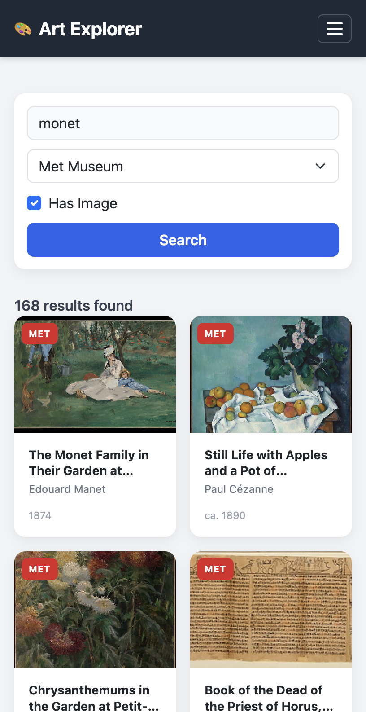
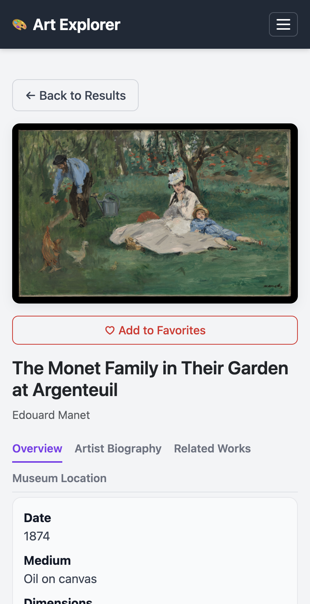
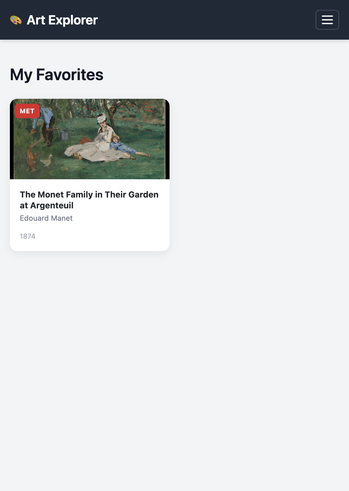

<div align="center">

# 🎨 Art Explorer

**Museum artwork search, detail, and favorites — Met & Harvard in one UI.**

[](https://art-explorer-517025217325.us-central1.run.app)
[](https://nodejs.org/)
[](https://expressjs.com/)

**[Open the app →](https://art-explorer-517025217325.us-central1.run.app)**

</div>

---

Art Explorer is a full-stack **museum discovery** app: search the **Met** and **Harvard Art Museums** together, open rich detail views (metadata, Wikipedia biography, related works, and a **Leaflet** map), and keep **favorites** in the browser via `localStorage`.

A **Node.js / Express** backend **proxies and normalizes** the public APIs so the Harvard key never ships to the client, payloads fit one frontend contract, and the browser only calls your host.

## Screenshots

<p align="center">
  <b>Search & results</b><br />
  <br /><br />
  <b>Artwork detail</b><br />
  <br /><br />
  <b>Favorites</b><br />
  
</p>

*Captured from the [production deploy](https://art-explorer-517025217325.us-central1.run.app); layout is responsive.*

## Highlights

- **Multi-source search** — filter by museum (Met, Harvard, or both), optional image-only results, debounced queries, skeleton loading, and server-driven pagination.
- **Unified detail experience** — Bootstrap tabs for overview, biography (Wikipedia REST), related works, and an interactive **Leaflet** map with museum locations.
- **Client-side favorites** — `localStorage` with no login required; works offline for saved lists after first load.
- **Production deployment** — containerized with Docker, hosted on **Google Cloud Run** (serverless, HTTPS, auto-scaling).

## Architecture

```
Browser  →  Express (this repo)  →  Met API · Harvard API · Wikipedia
                ↓
         Normalized JSON + static frontend (public/)
```

The Express layer handles orchestration (e.g. Met’s “search IDs then hydrate objects” pattern), merges or pages results when both museums are selected, and keeps secrets out of the browser bundle.

## Tech Stack

| Layer | Choices |
|--------|---------|
| Runtime | Node.js 18+ |
| Server | Express |
| Client | HTML, CSS, vanilla JavaScript |
| UI | Bootstrap 5.3, Leaflet 1.9.4 (CDN) |
| Data | [Met Collection API](https://metmuseum.github.io/), [Harvard Art Museums API](https://github.com/harvardartmuseums/api-docs), [Wikipedia REST](https://en.wikipedia.org/api/rest_v1/) |

## Run Locally

**Requirements:** Node.js 18+ and a [Harvard Art Museums API key](https://harvardartmuseums.org/collections/api) if you use Harvard or “both” sources (Met-only works without it).

```bash
git clone https://github.com/alalpaca/art-explorer.git
cd art_explorer
npm install
export HARVARD_API_KEY="your_key"   # omit for Met-only dev
npm start
```

Open [http://localhost:8080](http://localhost:8080).

## Docker

```bash
docker build -t art-explorer .
docker run --rm -p 8080:8080 -e HARVARD_API_KEY="your_key" art-explorer
```

The app listens on **8080** inside the container (Cloud Run–friendly).

## Deploy (Google Cloud Run)

Typical flow: enable Cloud Run + Cloud Build, build an image, deploy with the Harvard key as a runtime env var:

```bash
gcloud config set project YOUR_PROJECT_ID
gcloud services enable run.googleapis.com cloudbuild.googleapis.com artifactregistry.googleapis.com
gcloud builds submit --tag gcr.io/YOUR_PROJECT_ID/art-explorer
gcloud run deploy art-explorer \
  --image gcr.io/YOUR_PROJECT_ID/art-explorer \
  --platform managed \
  --region us-central1 \
  --allow-unauthenticated \
  --set-env-vars HARVARD_API_KEY=your_key
```

You can also use `gcloud run deploy --source .` for a single-step build and deploy.

## Repository Layout

```text
art_explorer/
├── assets/             # README screenshots
├── server.js           # API proxy, normalization, routing
├── Dockerfile
├── package.json
├── public/
│   ├── index.html
│   ├── css/styles.css
│   └── js/             # app shell, API client, favorites, map
└── process_log.txt     # optional: AI-assisted dev notes (internal)
```

## HTTP API (backend)

| Method | Path | Purpose |
|--------|------|---------|
| `GET` | `/` | Single-page app |
| `GET` | `/api/search` | `q`, `page`, `source`, `hasImage` |
| `GET` | `/api/artwork/:source/:id` | Detail (`met` \| `harvard`) |
| `GET` | `/api/artist/:name` | Wikipedia summary |
| `GET` | `/api/artist/:name/works` | Related thumbnails |

## Security

- Never commit `HARVARD_API_KEY` or expose it in frontend code.
- Use environment variables locally and in Cloud Run.

## License

Specify a license (e.g. MIT) if you open-source this for your portfolio; otherwise default copyright applies.
